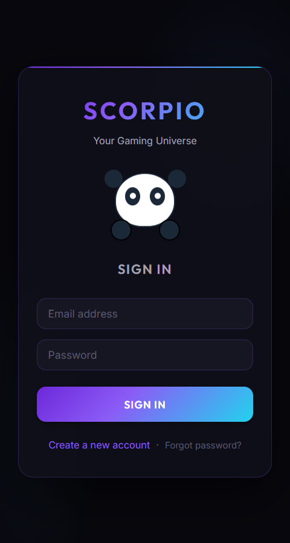
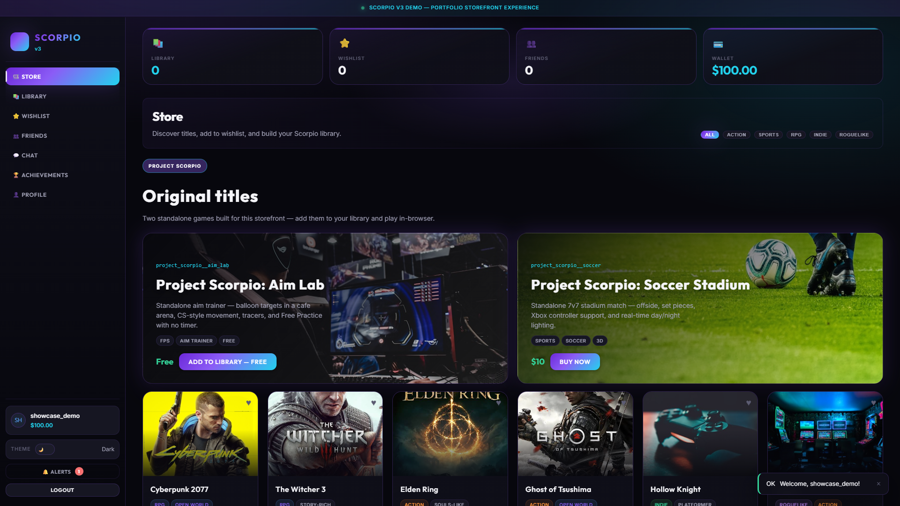
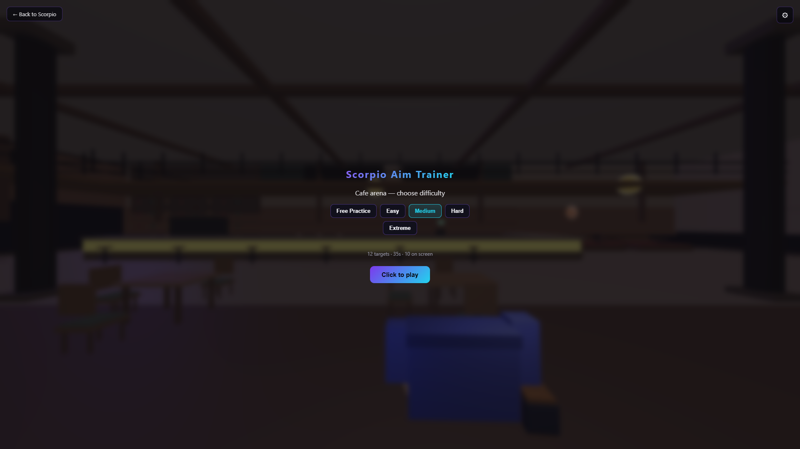
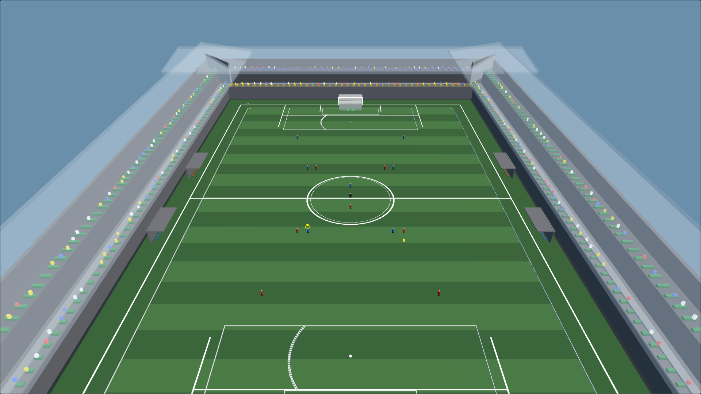
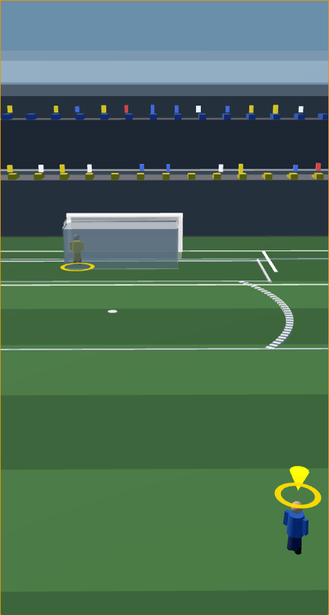

# Project Scorpio — visual showcase

Full **1920×1080** captures from **Microsoft Edge** at `http://localhost:3000`.

## Login mascots (video)

Screen recording of the auth mascot reactions — email curiosity, hidden password, wrong-login dismay + head-shake “no”, and success celebration.

> Credentials in the video are **fake demo-only** (`blorp.mcfake@totally-not-real.invalid` / `NopeNopeWrong999`) — not real account data.

<video src="https://github.com/faridali2003/project_scorpio/raw/master/docs/videos/mascot-login-showcase.webm" width="960" controls></video>

[Download `mascot-login-showcase.webm`](videos/mascot-login-showcase.webm) · [Re-record locally](#re-capture-locally)

## Platform (this repo)

| Login & auth UI | Store — Project Scorpio originals |
|-----------------|-----------------------------------|
|  |  |

The storefront includes accounts, library, friends, chat, wallet, and gift codes — all local demo only.

## Project Scorpio: Aim Lab

| Difficulty menu | In-game HUD |
|-----------------|-------------|
|  |  |

Standalone repo: [project_scorpio-aim-lab](https://github.com/faridali2003/project_scorpio-aim-lab)

## Project Scorpio: Soccer Stadium

| Pre-match | 7v7 match |
|-----------|-----------|
|  |  |

Standalone repo: [project_scorpio-soccer](https://github.com/faridali2003/project_scorpio-soccer)

## Re-capture locally

```bash
# Start backend + my-app, then:
node tools/record-mascot-showcase.mjs   # mascot login video (Edge 1920×1080)
node tools/capture-screenshots.mjs      # static screenshots
```

Uses Playwright with the installed **Microsoft Edge** channel at desktop resolution.  
The recorder registers a throwaway demo user with fake email/password — safe to publish in the video.

## What each repo demonstrates

| Repo | Skills shown |
|------|----------------|
| **project_scorpio** | Full-stack app, REST API, MySQL, JWT auth, Socket.io, Steam-style UX |
| **project_scorpio-aim-lab** | Three.js FPS, collision, pointer lock, procedural assets |
| **project_scorpio-soccer** | Three.js sports sim, AI, stadium GLB, gamepad input |
